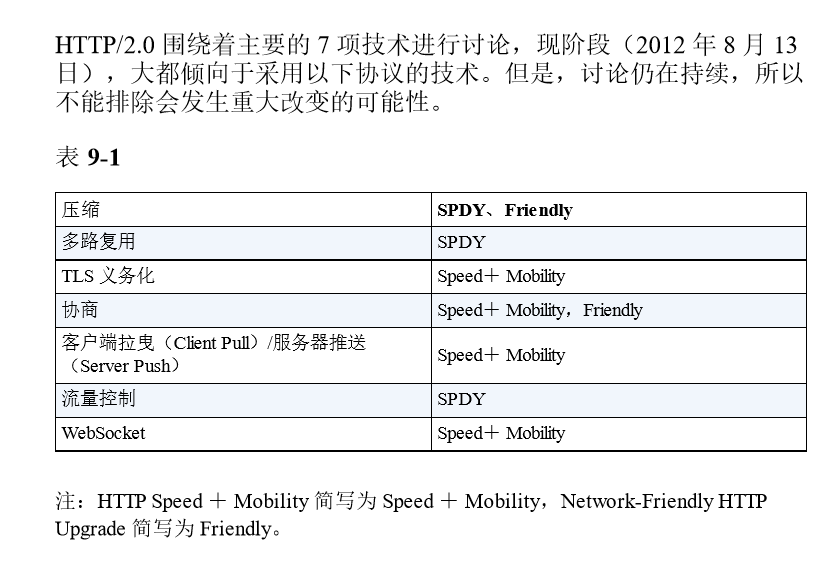
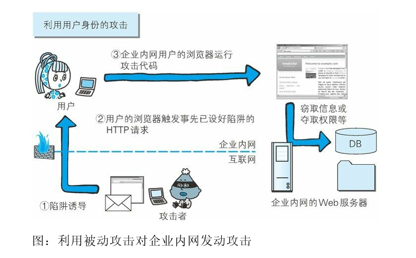
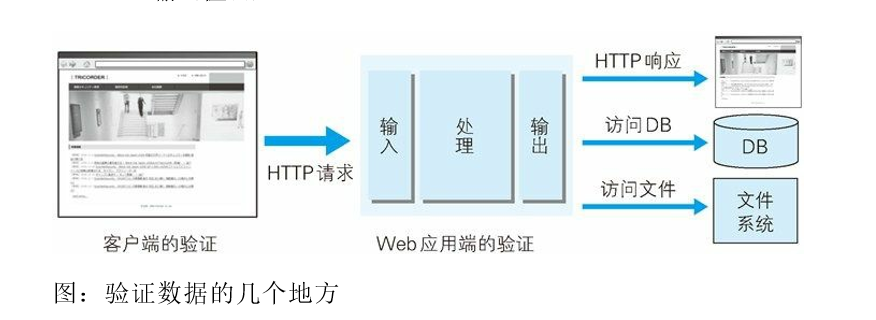

### 确认访问用户身份的认 证

##### 何为认证

HTTP/1.1 使用的认证方式如下所示 

BASIC 认证（基本认证）

 DIGEST 认证（摘要认证） 

SSL 客户端认证

 `FormBase `认证（基于表单认证） 

此外，还有 Windows 统一认证（`Keberos `认证、NTLM 认证)

##### BASIC认证

步骤 1： 当请求的资源需要 BASIC 认证时，服务器会随状态码 401 Authorization Required，返回带 WWW-Authenticate 首部字段的响应。 该字段内包含认证的方式（BASIC） 及 Request-URI 安全域字符串 （realm）。 

步骤 2： 接收到状态码 401 的客户端为了通过 BASIC 认证，需要将 用户 ID 及密码发送给服务器。发送的字符串内容是由用户 ID 和密码 构成，两者中间以冒号（:）连接后，再经过 Base64 编码处理。 假设用户 ID 为 guest，密码是 guest，连接起来就会形成 `guest:guest` 这 样的字符串。然后经过 Base64 编码，最后的结果即是 Z3Vlc3Q6Z3Vlc3Q=。把这串字符串写入首部字段 Authorization 后， 发送请求。当用户代理为浏览器时，用户仅需输入用户 ID 和密码即可，之后， 浏览器会自动完成到 Base64 编码的转换工作。

步骤 3： 接收到包含首部字段 Authorization 请求的服务器，会对认证 信息的正确性进行验证。如验证通过，则返回一条包含 Request-URI 资源的响应。

BASIC 认证虽然采用 Base64 编码方式，但这不是加密处理。不需要 任何附加信息即可对其解码。换言之，由于明文解码后就是用户 ID 和密码，在 HTTP 等非加密通信的线路上进行 BASIC 认证的过程 中，如果被人窃听，被盗的可能性极高。

另外，除此之外想再进行一次 BASIC 认证时，一般的浏览器却无法 实现认证注销操作，这也是问题之一。
BASIC 认证使用上不够便捷灵活，且达不到多数 Web 网站期望的安 全性等级，因此它并不常用。 

##### DIGEST 认证

步骤 1： 请求需认证的资源时，服务器会随着状态码 401 Authorization Required，返 回带 WWW-Authenticate 首部字段的响应。 该字段内包含质问响应方式认证所需的临时质询码（随机数， nonce）。

首部字段 WWW-Authenticate 内必须包含 realm 和 nonce 这两个字段的 信息。客户端就是依靠向服务器回送这两个值进行认证的。
nonce 是一种每次随返回的 401 响应生成的任意随机字符串。该字符 串通常推荐由 Base64 编码的十六进制数的组成形式，但实际内容依 赖服务器的具体实现。
步骤 2： 接收到 401 状态码的客户端，返回的响应中包含 DIGEST 认 证必须的首部字段 Authorization 信息。 首部字段 Authorization 内必须包含 username、realm、nonce、uri 和 response 的字段信息。其中，realm 和 nonce 就是之前从服务器接收到 的响应中的字段。
username 是 realm 限定范围内可进行认证的用户名。 uri（digest-uri）即 Request-URI 的值，但考虑到经代理转发后 Request-URI 的值可能被修改，因此事先会复制一份副本保存在 uri 内。
response 也可叫做 Request-Digest，存放经过 MD5 运算后的密码字符 串，形成响应码。
响应中其他的实体请参见第 6 章的请求首部字段 Authorization。另 外，有关 Request-Digest 的计算规则较复杂，有兴趣的读者不妨深入 学习一下 RFC2617。 

步骤 3： 接收到包含首部字段 Authorization 请求的服务器，会确认认 证信息的正确性。认证通过后则返回包含 Request-URI 资源的响应。 并且这时会在首部字段 Authentication-Info 写入一些认证成功的相关信 息。
DIGEST 认证提供了高于 BASIC 认证的安全等级，但是和 HTTPS 的 客户端认证相比仍旧很弱。DIGEST 认证提供防止密码被窃听的保护 机制，但并不存在防止用户伪装的保护机制。
DIGEST 认证和 BASIC 认证一样，使用上不那么便捷灵活，且仍达不 到多数 Web 网站对高度安全等级的追求标准。因此它的适用范围也 有所受限。

##### SSL 客户端认证

从使用用户 ID 和密码的认证方式方面来讲，只要二者的内容正确， 即可认证是本人的行为。但如果用户 ID 和密码被盗，就很有可能被 第三者冒充。利用 SSL 客户端认证则可以避免该情况的发生。 SSL 客户端认证是借由 HTTPS 的客户端证书完成认证的方式。凭借 客户端证书认证，服务器可确认访问是否 来自已登录的客户端。

第一个认证因素的 SSL 客户端证书用来认证客户端计算机， 另一个认证因素的密码则用来确定这是用户本人的行为

通过双因素认证后，就可以确认是用户本人正在使用匹配正确的计算 机访问服务器

##### 基于表单认证

由于使用上的便利性及安全性问题，HTTP 协议标准提供的 BASIC 认 证和 DIGEST 认证几乎不怎么使用。另外，SSL 客户端认证虽然具有 高度的安全等级，但因为导入及维持费用等问题，还尚未普及。

对于 Web 网站的认证功能，能够满 足其安全使用级别的标准规范并不存在，所以只好使用由 Web 应用 程序各自实现基于表单的认证方式

###### Session 管理及 Cookie 应用 

基于表单认证本身是通过服务器端的 Web 应用，将客户端发送过来 的用户 ID 和密码与之前登录过的信息做匹配来进行认证的。 

但鉴于 HTTP 是无状态协议，之前已认证成功的用户状态无法通过协 议层面保存下来。即，无法实现状态管理，因此即使当该用户下一次 继续访问，也无法区分他与其他的用户。于是我们会使用 Cookie 来 管理 Session，以弥补 HTTP 协议中不存在的状态管理功能。

客户端把用户 ID 和密码等登录信息放入报文的实体部分， 通常是以 POST 方法把请求发送给服务器。而这时，会使用 HTTPS 通信来进行 HTML 表单画面的显示和用户输入数据的发送。 步骤 2： 服务器会发放用以识别用户的 Session ID。通过验证从客户 端发送过来的登录信息进行身份认证，然后把用户的认证状态与 Session ID 绑定后记录在服务器端。 向客户端返回响应时，会在首部字段 Set-Cookie 内写入 Session ID（如 PHPSESSID=028a8c…）。 你可以把 Session ID 想象成一种用以区分不同用户的等位号。

然而，如果 Session ID 被第三方盗走，对方就可以伪装成你的身份进 行恶意操作了。因此必须防止 Session ID 被盗，或被猜出。为了做到 这点，Session ID 应使用难以推测的字符串，且服务器端也需要进行 有效期的管理，保证其安全性。
另外，为减轻跨站脚本攻击（XSS）造成的损失，建议事先在 Cookie 内加上 httponly 属性。 步骤 3： 客户端接收到从服务器端发来的 Session ID 后，会将其作为 Cookie 保存在本地。下次向服务器发送请求时，浏览器会自动发送 Cookie，所以 Session ID 也随之发送到服务器。服务器端可通过验证 接收到的 Session ID 识别用户和其认证状态

### 基于HTTP的功能追加协议

#### ajax

#### Comet

#### SPDY

多路复用流
通过单一的 TCP 连接，可以无限制处理多个 HTTP 请求。所有请求 的处理都在一条 TCP 连接上完成，因此 TCP 的处理效率得到提高。

赋予请求优先级
SPDY 不仅可以无限制地并发处理请求，还可以给请求逐个分配优先 级顺序。这样主要是为了在发送多个请求时，解决因带宽低而导致响 应变慢的问题。

压缩 HTTP 首部 压缩 HTTP 请求和响应的首部。这样一来，通信产生的数据包数量和 发送的字节数就更少了。

推送功能
支持服务器主动向客户端推送数据的功能。这样，服务器可直接发送 数据，而不必等待客户端的请求。

服务器提示功能
服务器可以主动提示客户端请求所需的资源。由于在客户端发现资源 之前就可以获知资源的存在，因此在资源已缓存等情况下，可以避免发送不必要的请求

#### `WebSocket`

由于是建立在 HTTP 基础上的协议，因此连接的发起方仍是客户端， 而一旦确立 `WebSocket` 通信连接，不论服务器还是客户端，任意一方 都可直接向对方发送报文

推送

减少通信量

只要建立起 `WebSocket `连接，就希望一直保持连接状态。和 HTTP 相 比，不但每次连接时的总开销减少，而且由于 `WebSocket `的首部信息 很小，通信量也相应减少了。

为了实现 `WebSocket` 通信，需要用到 HTTP 的 Upgrade 首部字 段，告知服务器通信协议发生改变，以达到握手的目的。

成功握手确立` WebSocket` 连接之后，通信时不再使用 HTTP 的数 据帧，而采用 `WebSocket `独立的数据帧。

#### Http2.0

#### `WebDev`

### 构建Web内容的技术

#### GCI

CGI（Common Gateway Interface，通用网关接口）是指 Web 服务器在 接收到客户端发送过来的请求后转发给程序的一组机制。在 CGI 的 作用下，程序会对请求内容做出相应的动作，比如创建 HTML 等动态内容。使用 CGI 的程序叫做 CGI 程序，通常是用 Perl、PHP、Ruby 和 C 等 编程语言编写而成。

#### HTML,XML

XML 和 HTML 都是从标准通用标记语言 SGML（Standard `GeneralizedMarkup` Language）简化而成。与 HTML 相比，它对数据的记录方式 做了特殊处理。

#### JSON

### Web攻击技术

现今的 Web 网站应用的 HTTP 协议的使用方式 已发生了翻天覆地的变化。几乎现今所有的 Web 网站都会使用会话 （session）管理、加密处理等安全性方面的功能，而 HTTP 协议内并 不具备这些功能。

从整体上看，HTTP 就是一个通用的单纯协议机制。因此它具备较多 优势，但是在安全性方面则呈劣势。

在 HTTP 请求报文内加载攻击代码，就能发起对 Web 应用的攻击。 通过 URL 查询字段或表单、HTTP 首部、Cookie 等途径把攻击代码传 入，若这时 Web 应用存在安全漏洞，那内部信息就会遭到窃取，或 被攻击者拿到管理权限。

#### 攻击模式

##### 主动攻击

SQL注入

OS命令注入攻击

#### 被动攻击

被动攻击通常的攻击模式如下所示。
步骤 1： 攻击者诱使用户触发已设置好的陷阱，而陷阱会启动发 送已嵌入攻击代码的 HTTP 请求。 

步骤 2： 当用户不知不觉中招之后，用户的浏览器或邮件客户端 就会触发这个陷阱。

步骤 3： 中招后的用户浏览器会把含有攻击代码的 HTTP 请求发 送给作为攻击目标的 Web 应用，运行攻击代码。 

步骤 4： 执行完攻击代码，存在安全漏洞的 Web 应用会成为攻 击者的跳板，可能导致用户所持的 Cookie 等个人信息被窃取， 登录状态中的用户权限遭恶意滥用等后果。

被动攻击模式中具有代表性的攻击是跨站脚本攻击和跨站点请求 伪造。

XSS攻击(跨站脚本攻击)

利用被动攻击，可发起对原本从互联网上无法直接访问的企业内 网等网络的攻击。只要用户踏入攻击者预先设好的陷阱，在用户 能够访问到的网络范围内，即使是企业内网也同样会受到攻击。

### 安全对策

#### 客户端的验证
####  Web 应用端（服务器端）的验证
输入值验证
输出值转义

#### XSS攻击 ( 跨站脚本攻击 )

1. 利用虚假输入表单骗取用户个人信息。

2. 利用脚本窃取用户的 Cookie 值，被害者在不知情的情况下， 帮助攻击者发送恶意请求。

3. 显示伪造的文章或图片。

XSS 是攻击者利用预先设置的陷阱触发的被动攻击
跨站脚本攻击属于被动攻击模式，因此攻击者会事先布置好用于 攻击的陷阱。

往表单中写入<script>标签的信息

#### SQL注入

##### SQL 注入攻击

1.非法查看或篡改数据库内的数据

2.规避认证

3.执行和数据库服务器业务关联的程序

往表单提交中写`sql`语句

#### `Os`命令注入攻击

可以从 Web 应用中通过 Shell 来调用操作系统命令。倘若调用 Shell 时存在疏漏，就可以执行插入的非法 OS 命令。

 OS 命令注入攻击可以向 Shell 发送命令，让 Windows 或 Linux 操作系 统的命令行启动程序。也就是说，通过 OS 注入攻击可执行 OS 上安 装着的各种程序。

往表单提交中写入shell脚本

#### HTTP 首部注入攻击 

向首部主体内添加内容的攻击称为 HTTP 响应截断攻击

HTTP 首部注入攻击（HTTP Header Injection）是指攻击者通过在响应 首部字段内插入换行，添加任意响应首部或主体的一种攻击。属于被动攻击模式。

HTTP 首部注入攻击有可能会造成以下一些影响。 

设置任何 Cookie 信息 

重定向至任意 URL

 显示任意的主体（HTTP 响应截断攻击）

#### 邮件首部注入攻击

邮件首部注入（Mail Header Injection）是指 Web 应用中的邮件发送功 能，攻击者通过向邮件首部 To 或 Subject 内任意添加非法内容发起的 攻击。利用存在安全漏洞的 Web 网站，可对任意邮件地址发送广告 邮件或病毒邮件。

#### 目录遍历攻击

目录遍历（Directory Traversal）攻击是指对本无意公开的文件目录， 通过非法截断其目录路径后，达成访问目的的一种攻击。这种攻击有 时也称为路径遍历（Path Traversal）攻击。 

#### 因设置或设计上的缺陷引发的安全漏 洞

##### 强制浏览

##### 不正确的错误消息处理

Web 应用抛出的错误消息

数据库等系统抛出的错误消息

不正确的错误消息处理导致安全漏洞的案例

##### 开放重定向

开放重定向（Open Redirect）是一种对指定的任意 URL 作重定向跳转 的功能。

##### 因会话管理疏忽引发的安全漏洞

###### 会话劫持

###### 会话固定攻击

###### 　跨站点请求伪造

#### 其他安全漏洞 

##### 密码破解

###### 网络进行密码试错

1.穷举法

2.字典攻击

###### 对已加密密码的破解

通过穷举法·字典攻击进行类推
彩虹表
拿到密钥
加密算法的漏洞

##### 点击劫持

##### Dos攻击

集中利用访问请求造成资源过载，资源用尽的同时，实际上服务也就呈停止状态。

通过攻击安全漏洞使服务停止。

##### 后门程序

后门程序（Backdoor）是指开发设置的隐藏入口，可不按正常步骤使 用受限功能。利用后门程序就能够使用原本受限制的功能

开发阶段作为 Debug 调用的后门程序

开发者为了自身利益植入的后门程序

攻击者通过某种方法设置的后门程序
